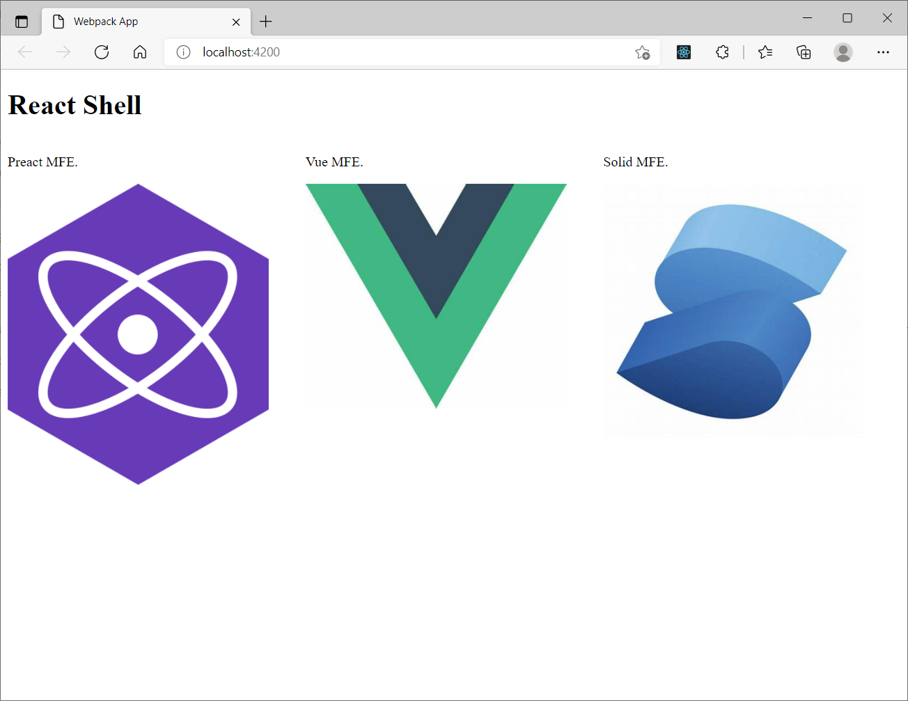

# mfe-apps

mfe-apps is an example micro fronted project based on Webpack Module Federation.



the mfe-apps contain four projects, the shell is based on react framework,
other three project is based on different framework and embed to the shell application.


## Installation

Use the package manager `pnpm` to install packages.

```bash
pnpm install --filter=.
```

## Usage

Start the projects:
```shell
pnpm run start --filter=.
```

Build all projects:

```shell
pnpm run build:prod --filter=.
```

## Contributing
Contributions are what make the open source community such an amazing place to learn, inspire, and create. Any contributions you make are greatly appreciated.

If you have a suggestion that would make this better, please fork the repo and create a pull request. You can also simply open an issue with the tag "enhancement". Don't forget to give the project a star! Thanks again!

1. Fork the Project
2. Create your Feature Branch (`git checkout -b feature/AmazingFeature`)
3. Commit your Changes (`git commit -m 'Add some AmazingFeature'`)
4. Push to the Branch (`git push origin feature/AmazingFeature`)
5. Open a Pull Request


Please make sure to update tests as appropriate.

## Contact

Curry Tang

Project Link: https://github.com/twn39/mfe-apps

## License
Distributed under the MIT License. See `LICENSE` for more information.
